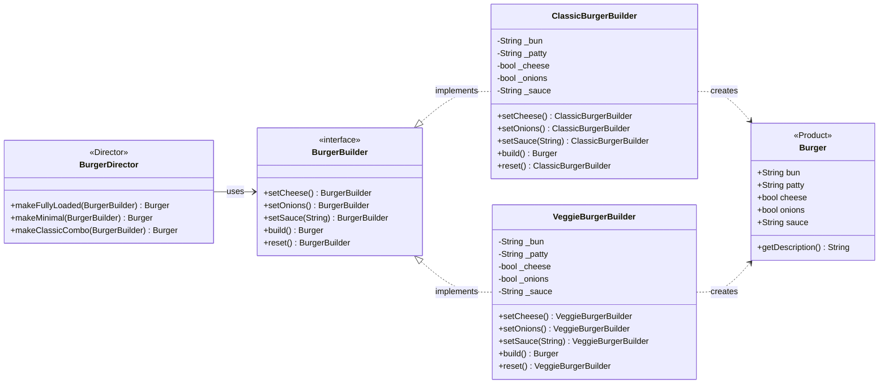

```mermaid
classDiagram
    direction LR

    class BurgerBuilder {
        <<interface>>
        +setCheese() BurgerBuilder
        +setOnions() BurgerBuilder
        +setSauce(String) BurgerBuilder
        +build() Burger
        +reset() BurgerBuilder
    }

    class ClassicBurgerBuilder {
        -String _bun
        -String _patty
        -bool _cheese
        -bool _onions
        -String _sauce
        +setCheese() ClassicBurgerBuilder
        +setOnions() ClassicBurgerBuilder
        +setSauce(String) ClassicBurgerBuilder
        +build() Burger
        +reset() ClassicBurgerBuilder
    }

    class VeggieBurgerBuilder {
        -String _bun
        -String _patty
        -bool _cheese
        -bool _onions
        -String _sauce
        +setCheese() VeggieBurgerBuilder
        +setOnions() VeggieBurgerBuilder
        +setSauce(String) VeggieBurgerBuilder
        +build() Burger
        +reset() VeggieBurgerBuilder
    }

    class Burger {
        <<Product>>
        +String bun
        +String patty
        +bool cheese
        +bool onions
        +String sauce
        +getDescription() String
    }

    class BurgerDirector {
        <<Director>>
        +makeFullyLoaded(BurgerBuilder) Burger
        +makeMinimal(BurgerBuilder) Burger
        +makeClassicCombo(BurgerBuilder) Burger
    }

    BurgerBuilder <|.. ClassicBurgerBuilder : implements
    BurgerBuilder <|.. VeggieBurgerBuilder : implements
    ClassicBurgerBuilder ..> Burger : creates
    VeggieBurgerBuilder ..> Burger : creates
    BurgerDirector --> BurgerBuilder : uses
```
